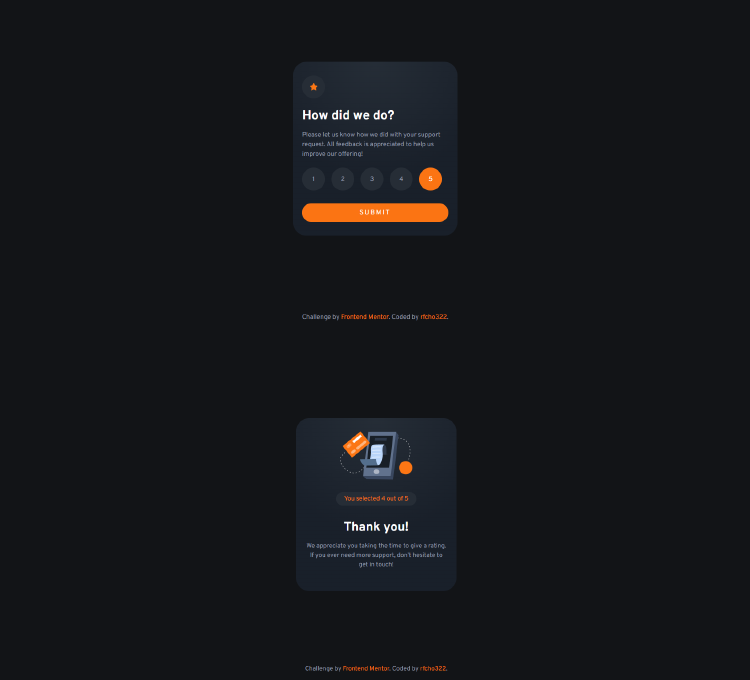
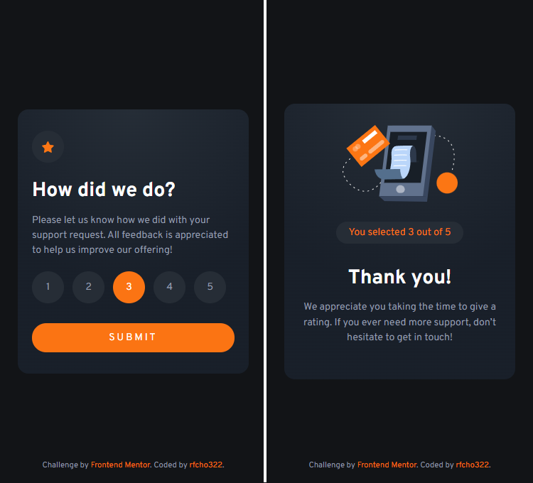

# Frontend Mentor - Interactive rating component solution

This is a solution to the [Interactive rating component challenge on Frontend Mentor](https://www.frontendmentor.io/challenges/interactive-rating-component-koxpeBUmI).

## Table of contents

- [Overview](#overview)
  - [The challenge](#the-challenge)
  - [Screenshot](#screenshot)
  - [Links](#links)
- [My process](#my-process)
  - [Built with](#built-with)
  - [What I learned](#what-i-learned)
- [Author](#author)

## Overview

### The challenge

Users should be able to:

- &#9989; View the optimal layout for the app depending on their device's screen size
- &#9989; See hover states for all interactive elements on the page
- &#9989; Select and submit a number rating
- &#9989; See the "Thank you" card state after submitting a rating

### Screenshot

<p align="center">
  <strong>Desktop</strong>
</p>
<p align="center">
  
</p>
<p align="center">
  <strong>Mobile</strong>
</p>
<p align="center">
  
</p>

### Links

- Frontend Mentor solution URL: [Interactive Rating Component Solution](https://www.frontendmentor.io/solutions/interactive-rating-component-solution-9oaxW5gDbM)
- Live Site URL: [Interactive Rating Component Live Website](https://rfcho322.github.io/fem-interactive-rating-component/)

## My process

### Built with

- Semantic HTML5 markup
- CSS custom properties
- Flexbox
- CSS Grid
- Mobile-first workflow

### What I learned

I am now enjoying the gradients in CSS &#127881;. This is what I did with the gradient background color of my card. I think It's somehow close to the design &#128526;.

```css
.card {
    background: radial-gradient(circle at top, var(--clr-neutral-400), var(--clr-neutral-500) 60%);
}
```

## Author

- Frontend Mentor - [@rfcho322](https://www.frontendmentor.io/profile/rfcho322)
